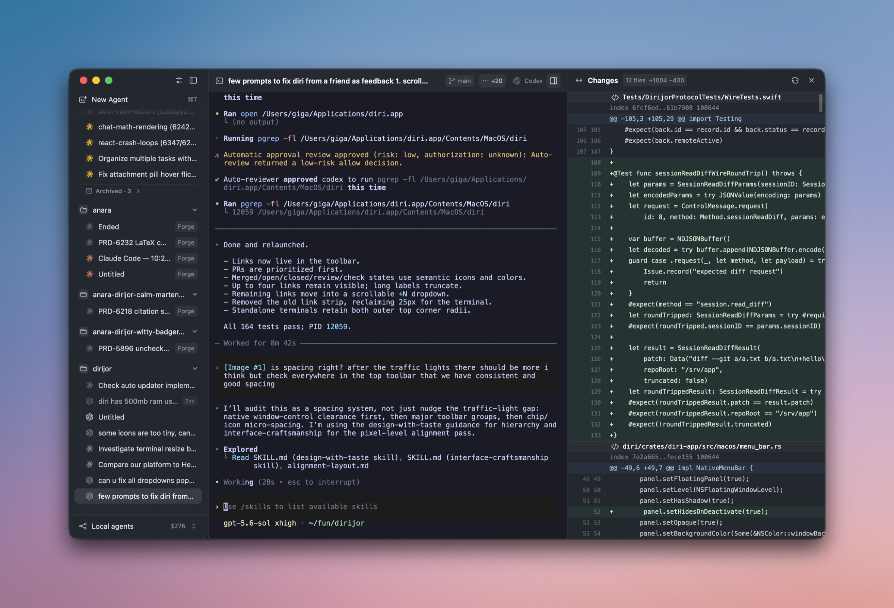

# zeus

[](https://github.com/nnayz/zeus/actions/workflows/ci.yml)

Native macOS orchestrator for coding agents. Run Claude Code, Codex, Cursor, Gemini and plain
shells in parallel — across git worktrees or on remote hosts — each with a live status
(working / needs-you / done) and tmux-like persistence: closing the app never kills a session,
and a daemon restart brings conversations back.



## Install

Download the latest DMG from [Releases](https://github.com/nnayz/zeus/releases/latest),
open it, and drag zeus to Applications. Universal (Apple silicon and Intel), signed and
notarized. zeus updates itself from there.

macOS 15 or newer.

## What it does

- **Many agents at once.** Each session is a real terminal with a real PTY. Group them by
  project, split them across git worktrees, or run them on a remote host over ssh+tmux.
- **Status you can trust.** zeus reads what an agent actually painted on its screen and tells
  you which ones are working, which are waiting on you, and which are done — so you can watch
  ten sessions without reading ten terminals.
- **Sessions outlive the app.** A background daemon owns the PTYs. Quit zeus, reopen it, and
  everything is still there.
- **Agents can orchestrate agents.** An MCP server lets a running agent spawn another one,
  watch it, read its output, and answer its prompts.

First-class status detection and resume are Claude Code and Codex. Cursor and Gemini run with
partial support, and anything else runs as a terminal with running/exited status.

## Architecture

Two processes, one wire protocol:

- **`zeus`** — the desktop app: Rust + [GPUI](https://github.com/zed-industries/zed). Owns the
  window, sidebar, terminal renderer, command palette, and usage accounting. Lives in
  [`zeus/`](zeus/).
- **`zeusd`** — a headless Swift daemon, launched by the app and outliving it. Owns PTYs and
  child agent processes, an offset-addressed output log per session (for detach and replay), a
  headless terminal emulator for status detection, the session registry and persistence,
  worktrees, and the control socket.

`zeus` is a small CLI: the MCP shim injected into agents, the hook and notify forwarders, and
`status`/`doctor`. `zeusd-holder` owns the PTY master so sessions survive a daemon restart.

> **A Rust port of the engine is in progress** in `zeus/crates/zeus-engine`, so that zeus can run
> on Linux and Windows. It is not shipped — the released app runs the Swift daemon above. See
> [`zeus/PORT.md`](zeus/PORT.md) for what is done and what is left.

## Adding an agent

Agent support is data, not code. Each agent is one JSON file in
`Sources/ZeusCore/Resources/manifests/` describing how to spawn it, how to resume, which keys
approve or deny a prompt, and the screen rules that decide whether it is working, waiting, or
done. Copy the closest existing manifest and adjust it — no Swift or Rust required. This is the
easiest way to contribute.

## Building from source

Needs both toolchains: Rust (pinned in `zeus/rust-toolchain.toml`) and Swift 6 with the Xcode
command-line tools. The first Rust build compiles GPUI from a pinned Zed revision and takes a
while.

```sh
swift build && swift test          # engine
cd zeus && cargo build             # app
cargo run -p zeus-app

zeus/scripts/package.sh            # full bundle
zeus/scripts/install-local.sh
```

[`zeus/PACKAGING.md`](zeus/PACKAGING.md) covers signing and notarization,
[`zeus/UPDATING.md`](zeus/UPDATING.md) the updater and release flow,
[`zeus/NODE.md`](zeus/NODE.md) running agents on a remote VPS node.

## Contributing

See [CONTRIBUTING.md](CONTRIBUTING.md). Bug reports, fixes, and new agent manifests all welcome.

## License

Apache 2.0. See [LICENSE](LICENSE) and [NOTICE](NOTICE).
