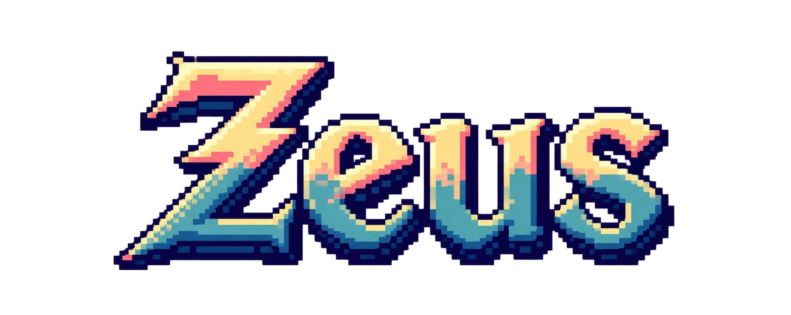
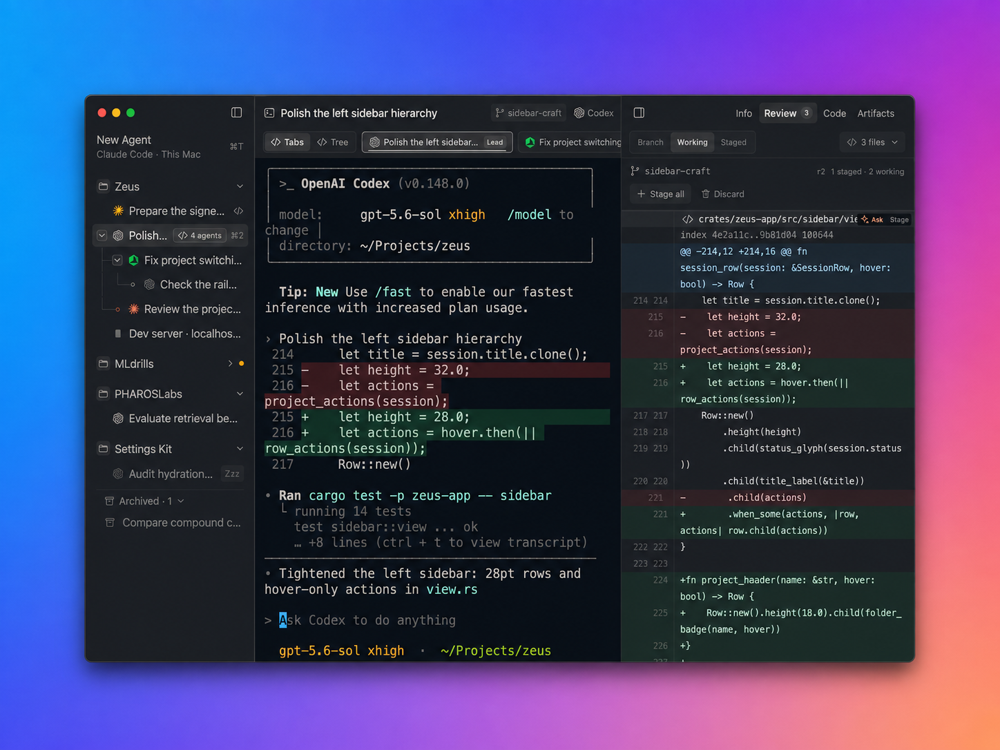

<div align="center">
    <h1></h1>
</div>

[](https://github.com/nnayz/zeus/actions/workflows/ci.yml)
[](https://github.com/nnayz/zeus/releases/latest)

Zeus is a native macOS command center for coding agents. It gives Claude Code,
Codex, Cursor, Grok, OpenCode, Gemini, and ordinary shells their own live
terminals, then lets you run them side by side in local Git worktrees or on
machines reached through SSH.

Every session advertises a simple state: working, waiting for you, or finished.
You can supervise the group without continually scanning terminal output. The
sessions belong to a background Engine, not the window: quitting Zeus does not
stop them, and an Engine restart can recover their conversations.



## Get Zeus

Zeus requires macOS 15 or later. Version 0.3.0 is available as a universal DMG
from the [GitHub release](https://github.com/nnayz/zeus/releases/tag/v0.3.0).
Download it, move Zeus into Applications, then right-click the app and choose
**Open**. The package supports both Apple silicon and Intel Macs.

The [illustrated macOS install guide](https://nnayz.github.io/zeus/install/)
shows the complete one-time Gatekeeper flow, including the **Privacy &
Security → Open Anyway** fallback.

Version 0.3.0 is ad-hoc signed. It is not Developer ID signed or notarized, so
Gatekeeper may reject a normal double-click. It cannot be installed through
Homebrew, and the built-in updater will not accept it. Read the
[security notes](SECURITY.md) before installing.

Homebrew installation and in-app updates are planned for a future release once
Developer ID signing and Apple notarization are in place.

## A quick first run

1. Choose a project with `⌘O` or `⌘P`, then create a session with `⌘N`.
   `⌘T` starts the configured default agent.
2. Launch more sessions as needed. Put concurrent writers in separate Git
   worktrees, and let a capable parent agent use `spawn_agent` when it should
   coordinate its own children.
3. Follow the sidebar rather than tailing every terminal. `⌘⇧J` selects the
   next session awaiting input; **Agent Workflow Tree** is available from `⌘K`.
4. Review proposed changes in the inspector's **Review** tab. You can close and
   reopen the app without surrendering the PTYs held by the Engine.

The complete guide is published at [docs.zeus.nasrul.info](https://docs.zeus.nasrul.info).
It covers the workbench, shortcuts, agent setup, orchestration, fleet patterns,
remote execution, and removal. To preview that book locally, run
`mdbook serve docs`.

## The operating model

- **Parallel sessions without terminal juggling.** Every agent receives a real
  PTY. Sessions can share a project, occupy isolated worktrees, or execute on an
  SSH host.
- **State at a glance.** Zeus interprets the screen an agent actually renders
  and reduces it to useful states such as active, attention required, and done.
- **Processes independent of the UI.** PTYs are retained outside the desktop
  process, so closing the window does not end the work behind it.
- **Agent-driven coordination.** Through Zeus's MCP interface, one running agent
  can create another session, observe it, collect its output, and respond when
  it asks a question.

Claude Code and Codex currently have the deepest resume and state integration.
Cursor, Grok, OpenCode, Gemini, and the rest of the catalog still receive a full
PTY and sidebar presence. If no manifest exists for a command, Zeus opens it as
a basic terminal and reports only whether it is running or has exited.

## How it is assembled

The desktop and session machinery are implemented in Rust:

- **Desktop application:** `zeus`, built with
  [GPUI](https://github.com/zed-industries/zed), renders the workbench, terminal,
  sidebar, command palette, and usage views. Its workspace is [`zeus/`](zeus/).
- **Local Engine:** `zeusd-rs` owns the session registry, child processes, PTYs,
  persistence, worktrees, and local control socket. It is launched by the app
  but is able to remain alive after the app exits.
- **Session holders:** `zeus-holder` retains local PTY ownership across Engine
  replacement or restart. Remote sessions use a bootstrapped Rust Remote PTY
  Holder over SSH rather than a remote terminal multiplexer.
- **Automation CLI:** the bundled `zeus` command provides hooks, notifications,
  the MCP bridge, and commands such as `status` and `doctor`.

The desktop communicates with the Engine through a versioned protocol; the app
does not launch SSH on its own. See [`zeus/REMOTE_PORT.md`](zeus/REMOTE_PORT.md)
for the remote transport's active design constraints.

## Extending agent support

Agent behavior is catalog data. Files under
[`zeus/crates/zeus-engine/manifests/`](zeus/crates/zeus-engine/manifests/)
declare each agent's launch and resume behavior, its prompt approval and denial
keys, and the screen patterns used for status detection. Supporting an agent
does not require hard-coding it into the application.

## Compile it yourself

The required Rust version is fixed by
[`zeus/rust-toolchain.toml`](zeus/rust-toolchain.toml). Expect the initial build
to take longer because it compiles GPUI from Zeus's pinned Zed revision.

```sh
(cd zeus && cargo build)                   # compile the workspace
(cd zeus && cargo run -p zeus-app)         # launch a development build

zeus/scripts/package.sh                    # assemble the application bundle
zeus/scripts/install-local.sh              # install that local bundle
```

Run the repository's main CI-equivalent checks with:

```sh
./scripts/check.sh
```

The source for the user guide is in [`docs/`](docs/). Release engineering is
documented in [`zeus/PACKAGING.md`](zeus/PACKAGING.md) and
[`zeus/UPDATING.md`](zeus/UPDATING.md).

## Help and policies

For product help, bug reports, or general feedback, email
**[hi@nasrul.info](mailto:hi@nasrul.info)**. Potential vulnerabilities should
follow the private process in [SECURITY.md](SECURITY.md).

Additional project information: [support](docs/src/support.md),
[privacy](docs/src/privacy.md), [security model](docs/src/security-model.md),
and [roadmap](docs/src/roadmap.md).
